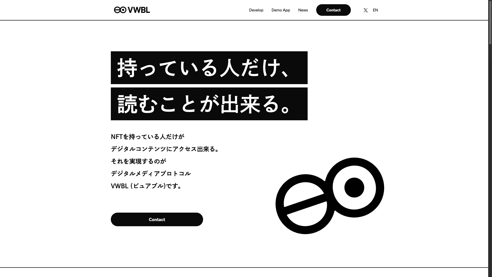
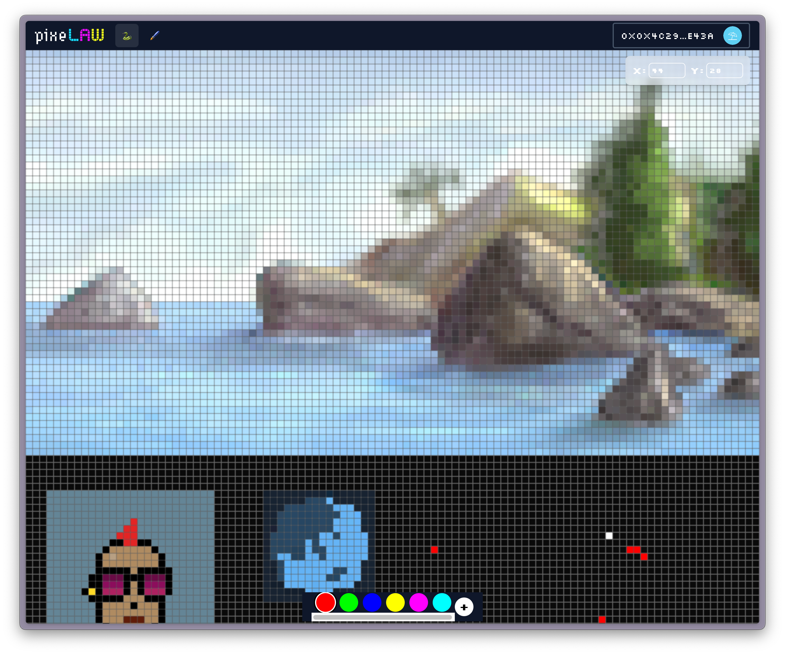
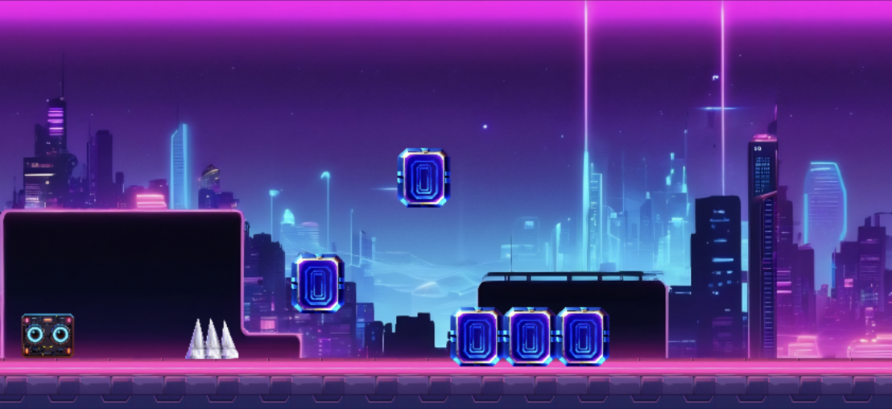

# Talk Title

Asuma Yamada

---

## Profile

### Asuma Yamada

#### Sample Inc.

GitHub: [@posaune0423](https://github.com/posaune0423)
𝕏: [@0xasuma](https://x.com/0xasuma)

- 📆 2024 - Present 🌏 **PixeLAW**
  - Starknet上のピクセルベースAutonomous Worldプロジェクト
- 📆 2023 -2024 💎 **Unikura**
  - 動産RWA NFT Marketplace
- 📆 2021 - 2023 👀 **VWBL Protocol**
  - NFTの分散型アクセスコントロールプロトコル

---

## VWBL Protocol

---

## Unikura

---

## PixeLAW

---

## Table of Contents

- Title 1
- Title 2
- Title 3

---

# Title 1

---
<!-- header: Title 1 -->

## Sth about Title1
---
<!-- header: ''-->

# Title 2

---

<!-- header: Title 2 -->

## What is Title 2

---

## p/dash

- PixeLAW上のカジュアルゲーム
- Geometry Dash likeな横スクロールカジュアルゲーム
- マリオメーカーのような[Stage Creation]()と [Client Side proof generation]()
- Seed Grantで$25k 獲得

<video src="./images/pixelaw.mp4" width="500" controls muted autoplay loop playsinline></video>

---

## さいごに

Some message to the audience

---

<!-- header: '' -->

Thank you for listening!

