# OSSコミットとゲマインシャフト的開発体験の楽しさ

Asuma Yamada

---

## Profile

### Asuma Yamada

#### Sample Inc.

GitHub: [@posaune0423](https://github.com/posaune0423)
𝕏: [@0xasuma](https://x.com/0xasuma)

- 📆 2024 - Present 🌏 **PixeLAW**
  - Starknet上のピクセルベースAutonomous Worldプロジェクト
- 📆 2023 -2024 💎 **Unikura**
  - 動産RWA NFT Marketplace
- 📆 2021 - 2023 👀 **VWBL Protocol**
  - NFTの分散型アクセスコントロールプロトコル

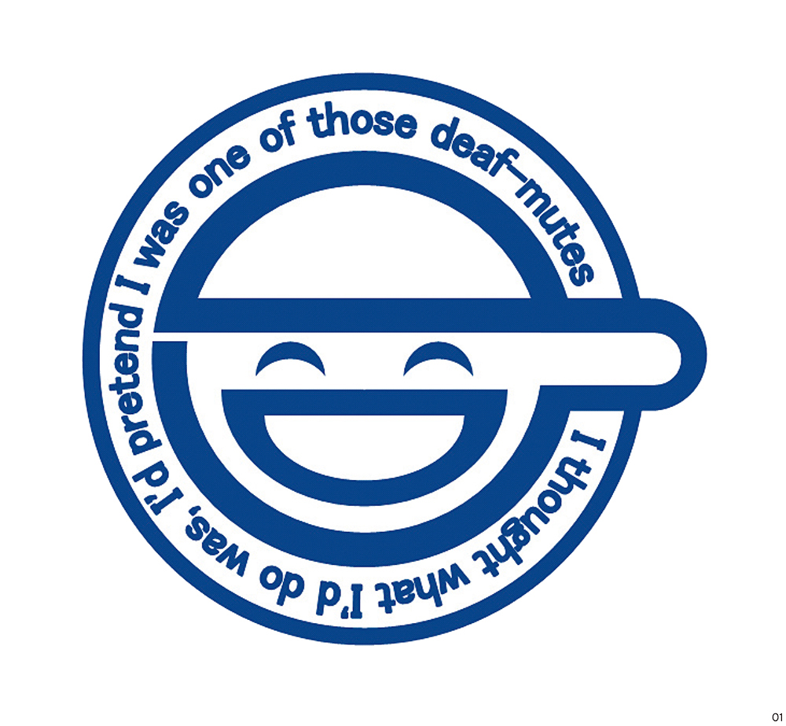

---

## VWBL Protocol

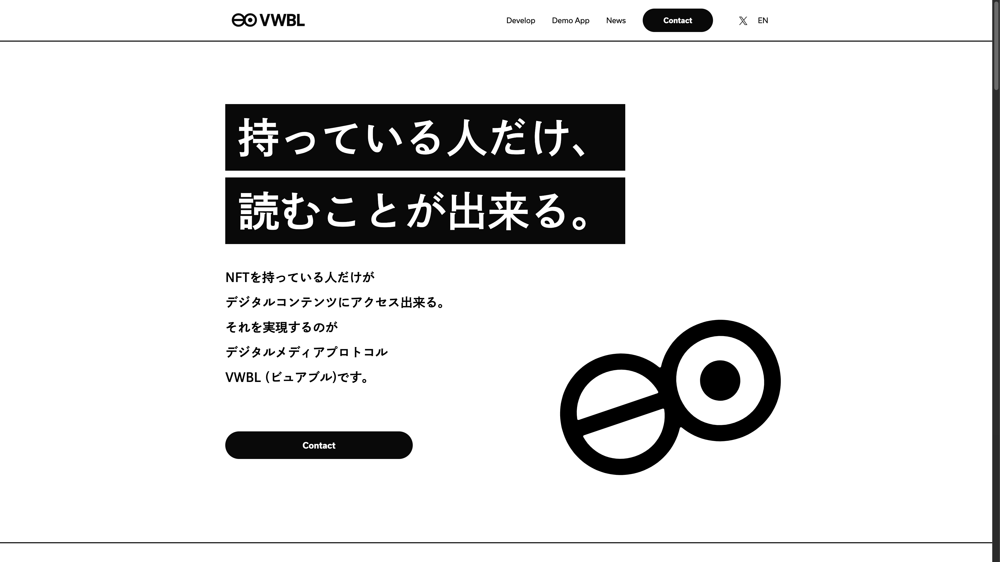

---

## Unikura

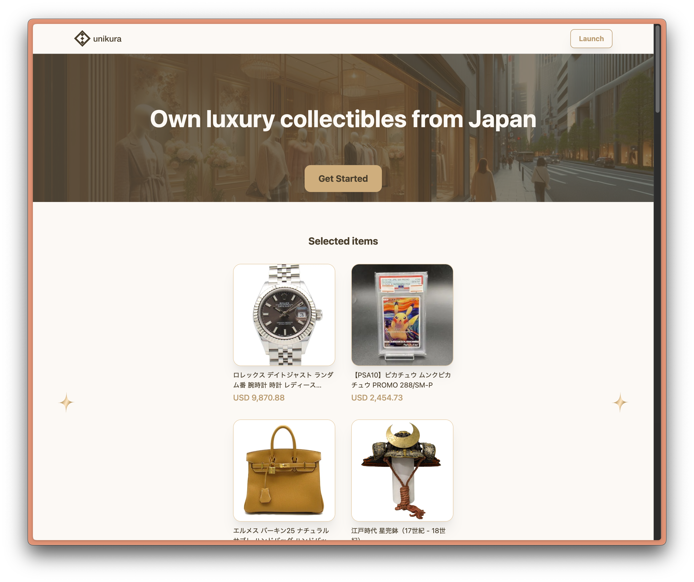

---

## PixeLAW

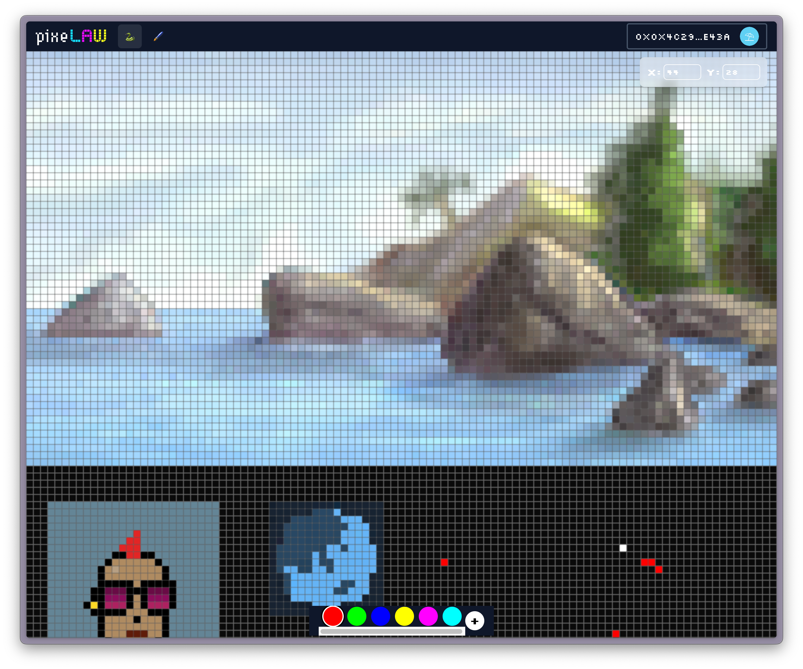

---

## Table of Contents

- Dojo Residency Program
- ゲマインシャフト的OSS開発体験の楽しさ
- 3つのソフトスキル(教訓)

---

# Dojo Residency Program

---

<!-- header: Dojo Residency Program -->

## What is Dojo Framework ⛩️

[Cartridge](https://cartridge.gg/)社が開発を主導しているOSSであり、[STARK](https://zenn.dev/qope/articles/8d60f77e3a7630)というゼロ知識証明技術を用いて[Ethereum](https://ethereum.org/)に接続されたLayer2ブロックチェーンである[Starknet](https://www.starknet.io/)で活発化している[FOCG](https://medium.com/coinmonks/fully-on-chain-games-research-ui-246c42cecae2)を作るための[Cairo](https://www.cairo-lang.org/)製ECSフレームワーク

---

## Anatomy

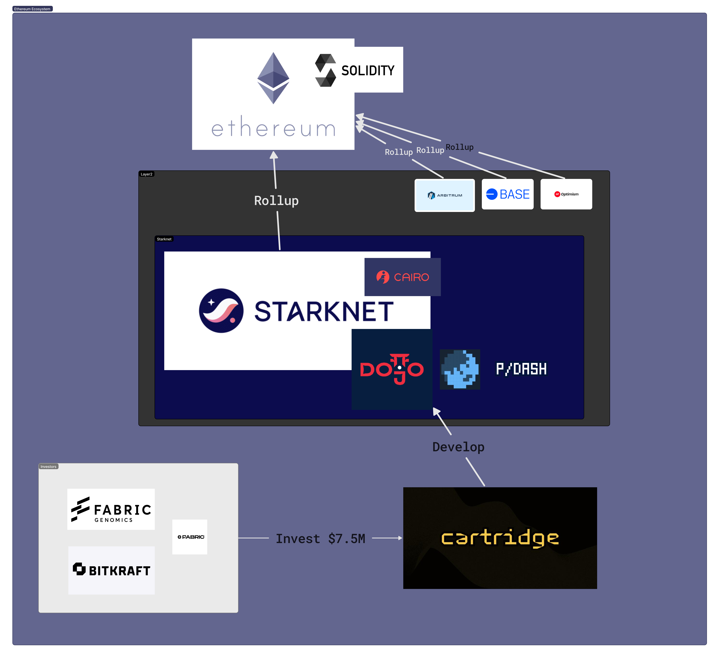

---

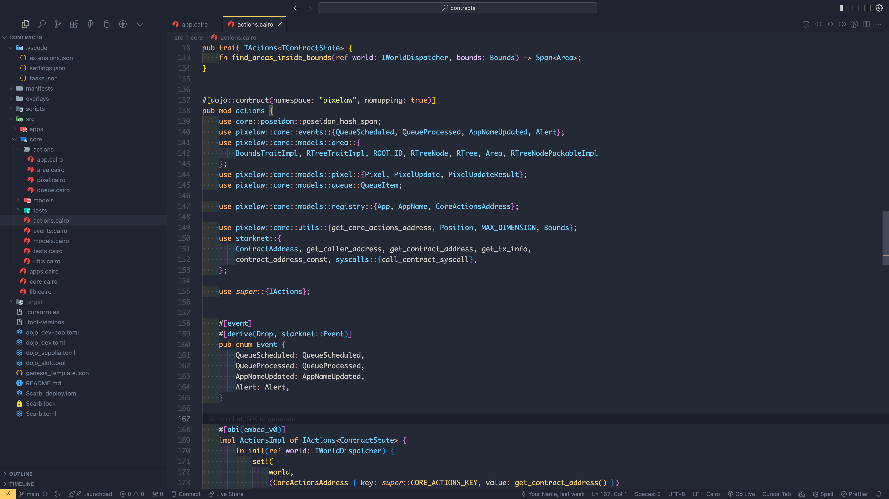

---

## 改めてResidency Programとは

- Cartridge社と(恐らく)Starknet Foundationが開発コミュニティ醸成とDeveloperの誘引の為にhostした2ヶ月間のグローバル開発合宿
- 世界から約30名ほどが参加
- なんと渡航費、食事代、宿泊費 **0**

---

## 参加前の自分の状態

|             |                                                             |
| ----------- | ----------------------------------------------------------- |
| 英語        | 中の中                                                      |
| Rust(Cairo) | 未経験                                                      |
| Starknet    | 未経験                                                      |
| ゲーム開発  | 未経験                                                      |
| 仕事        | SAI開発フルコミット、配属関連で人事や各所と面談し休職を断行 |

---

## Program Content

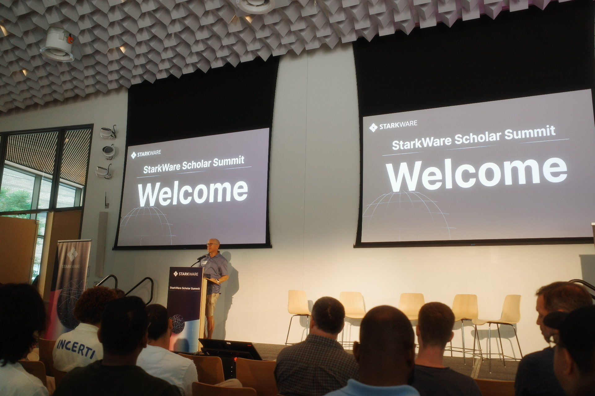

Kickoff イベント＠Long Island

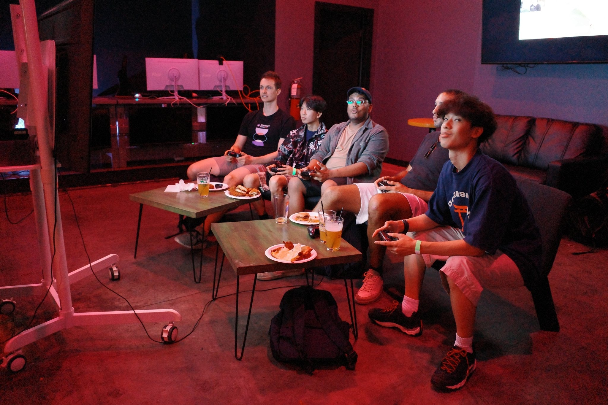

Game Event@Brooklynのgame bar

普段のオフィスでの開発の様子

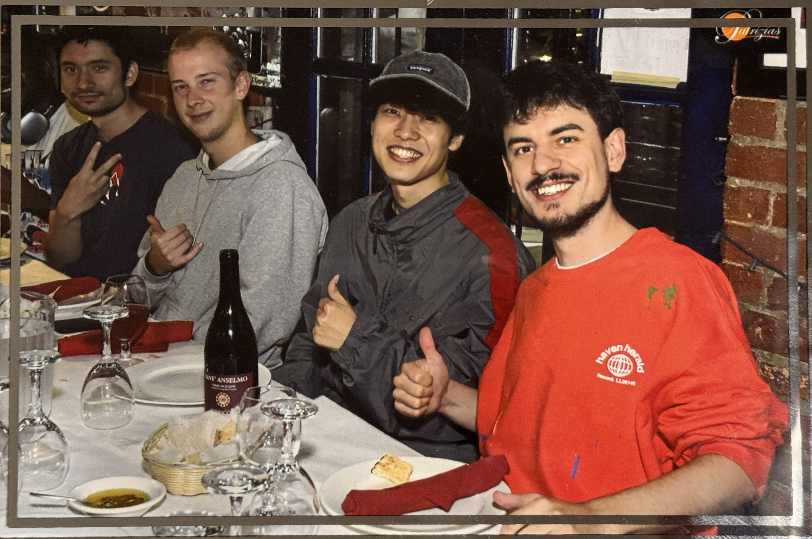

最後の晩餐@Brooklyn

---

## p/dash

- PixeLAW上のカジュアルゲーム
- Geometry Dash likeな横スクロールカジュアルゲーム
- マリオメーカーのような[Stage Creation]()と [Client Side proof generation]()
- Seed Grantで$25k 獲得

<video src="./images/pixelaw.mp4" width="500" controls muted autoplay loop playsinline></video>

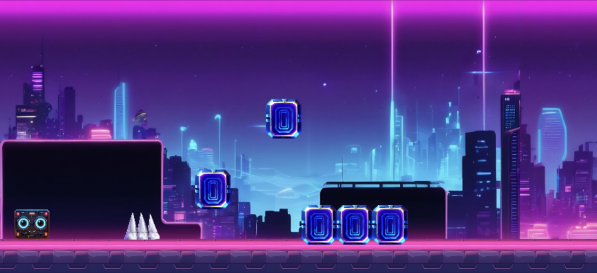

---

<!-- header: '' -->

# ゲマインシャフト的OSS開発体験の楽しさ

---

<!-- header: ゲマインシャフト的OSS開発体験の楽しさ -->

## ゲマインシャフト <=> ゲゼルシャフト

#### ゲマインシャフト

地縁や血縁などで深く結びついた自然発生的なコミュニティ

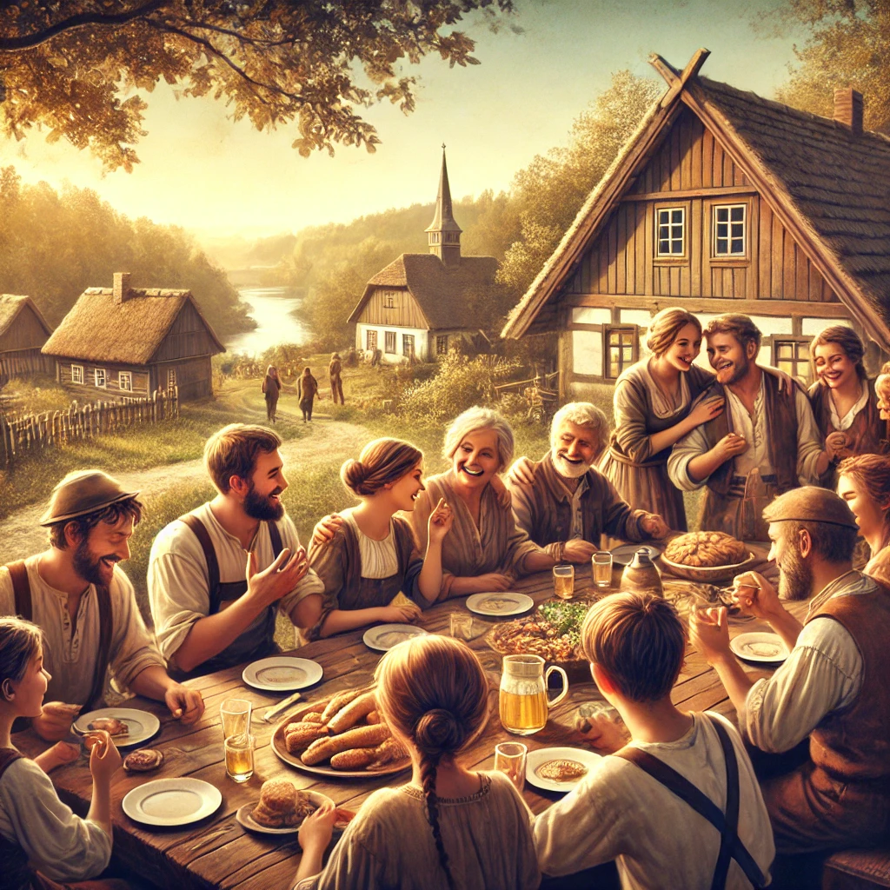

#### ゲゼルシャフト

利益や機能・役割によって結びついた人為的なコミュニティ

---

## ゲマインシャフト的要素

- そもそもOSSのCommitterやそれぞれOwnershipを持つpjを持つゲーム開発者達が集まっている
  - 給料や昇進などという概念は当然ない
- 株主やstake holderなど忖度する様な存在もいない
- 皆同じ志で身銭を切ってコミュニティに貢献するマインドセットが共有できている

---

## 何がいいの

- Core Committer達との交流
  - 対面で顔を認識して話す、というのがとても新鮮だしCommitするハードルも下がる
- コアな領域に張っているもの好き達が集まっているので皆ユニークで面白い
- 皆目先の利益や給料とか気にしてない、「ただ面白いものを作る」という事に専念している

---

<!-- header: '' -->

# 3つのソフトスキル(教訓)

---

<!-- header: 3つのソフトスキル(教訓) -->

## いいタイミング、なんて存在しない

- 研修が終わり丁度全新卒社員が最初の部署配属をされるという1番大切な時期での渡米
- passionは生物、やりたいことがあるなら優先度の低いものを中断して今すぐにやる(now or never)

---

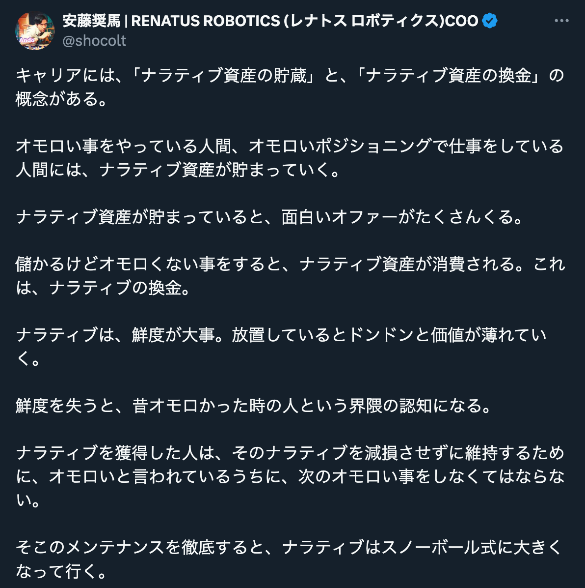

---

## 英語から逃げない

- ペラペラでなくてもいい、習慣にするのが大事
- fortunate fact: ある1つの言語を習得している人間なら他のn言語も基本的に習得可能(Chomsky: 生成文法, Krashen: Language Acquisition)

---

## 「世界に存在しない」を言い訳にしない

- 世界に存在してないものこそチャンスだと捉える、捉えられるマインドセットが大事
- Language Serverも整備されていない様なカオスでの開発
- ドキュメントにまとまってあることなどほぼない、ひたすらソースコードを読め、もしくは自分でPRを出せ

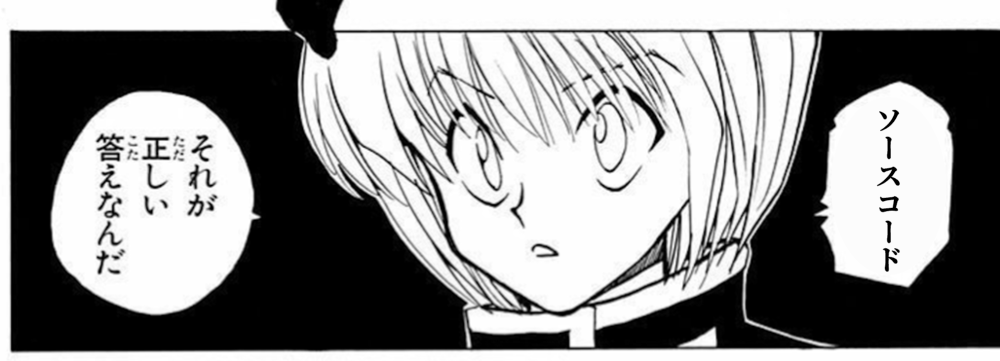

---

## さいごに

Cryptoの領域でSoftware Engineerは

多分今世界で一番楽しい職業です。

今日お伝えした内容に共感できる人は今すぐp/dashをplayし

Cryptoの世界にDiveしましょう！

---

<!-- header: '' -->

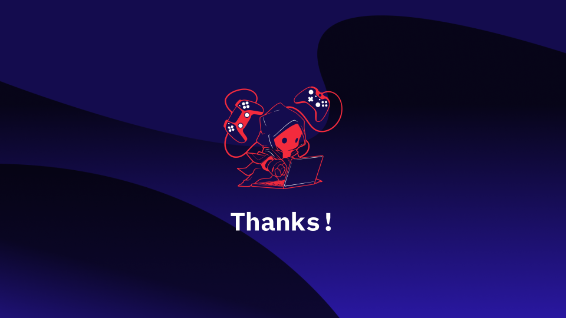

---

## Appendix

- [zk-SNARKsとzk-STARKsの比較 - LayerX Research](https://scrapbox.io/layerx/zk-SNARKs%E3%81%A8zk-STARKs%E3%81%AE%E6%AF%94%E8%BC%83)
- [VWBL](https://vwbl-protocol.org/)
- [Unikura | Own Japanese collectibles](https://www.unikura.xyz/)
- [【解説マップ】ゲマインシャフトとゲゼルシャフト（山口周・武器になる哲学） ｜【公式】MindMeister（マインドマイスター）](https://mindmeister.jp/posts/kaisetu-buki07)
- [STARKの原理](https://zenn.dev/qope/articles/8d60f77e3a7630)
- [Starknetのオンチェーンゲームエンジン「Dojo」の概要と、オンチェーンゲーム領域における「ゲームエンジン」の現状と課題について考察 | イーサリアムnavi](https://ethereumnavi.com/2023/03/04/starknet-dojo/)
- [『Autonomous Worldの分野で1番になりたい』｜PixeLAWのco-founder（共同創業者）SHORAさんに取材](https://ethereumnavi.com/2024/05/11/interview-for-shora/)

